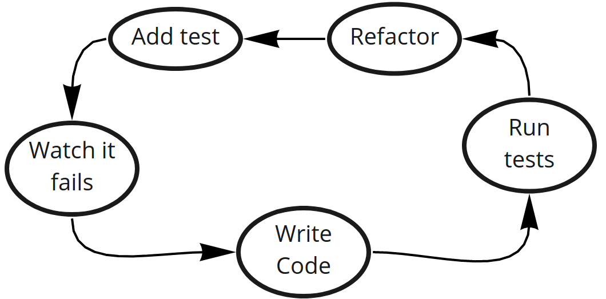

# Ciclo do TDD

O ciclo do TDD em cima de muitas fontes, aparece com o disposto abaixo

Começando na etapa "Add Test". Você passa para a etapa "Watch it fails", com o objetivo de identificar o que precisa ser feito dentro do código para que ele funcione, a partir disso você irá escrever o código para que esse teste passe corretamente, rodar os testes novamente, refatorar o que for necessário e então adicionar novos testes.

**Porque devo fazer um teste falhar?**

Partindo da premissa que estamos testando funcionalidades não desenvolvidas. Caso você crie um teste que não falha, isso significa que estamos criando um teste para uma funcionalidade já existente. Tudo isso faz com que o TDD se perca em seu ciclo.

## Core do TDD

* RED - TEST FAILS
* GREEN - TEST PASSES
* REFACTOR - CLEAN CODE + TESTS

Essas são as 3 etapas principais do TDD, e do desenvolvimento de software guiado.

## Adicionar um teste

* Projetar a interface da classe que está sendo trabalhada (atributos).
* Definir comportamento esperado (métodos e retornos).

## Fazer o teste passar

* Criar o comportamento da classe
* Buscar a solução mais simples possível para que o teste passe.

O objetivo aqui é manter o código mais manutenível possível e também prezar pela limpeza do código.

## Refatorar

* Limpar o código que foi criado. (Clean Code)
* Ajudar o design da classe para seu estado atual.

> Baby Steps: Devo alternar com frequência entre criar testes e código de produção.