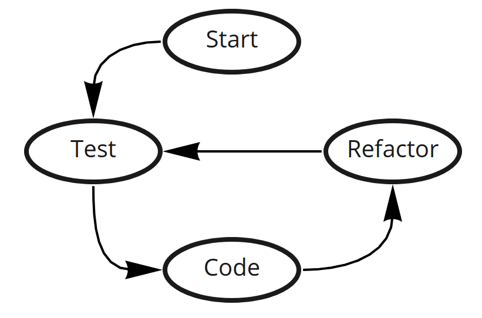

# Introdução

> TDD - Test Driven Development, é uma técnica de desenvolvimento de software, em que os testes são criados antes do código de produção.

Material relacionado ao curso: `TDD - Desenvolvimento de Software Guiado por Testes` oferecido pelo ITA na plataforma Coursera.

# Primeiros Passos no TDD

Primeiramente, é necessário de inicio criar um teste, depois desenvolve o código que se encaixe naquele código, refatore o que precisar ser refatorado. E então testa novamente.

> TDD is a crazy idea that works! - Kent Beck